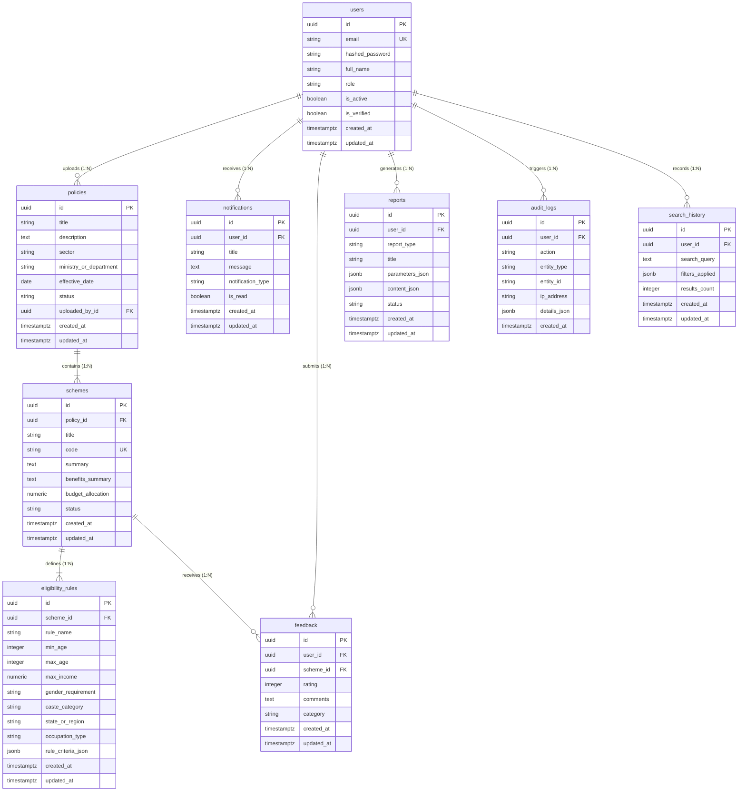

# Entity Relationship Diagram (ERD) - PolicyGPT (Milestone 1)

This document provides the visual Entity Relationship Diagram (ERD) for the PolicyGPT database architecture using Mermaid notation.

```mermaid
erDiagram
    users ||--o{ policies : "uploads (1:N)"
    users ||--o{ notifications : "receives (1:N)"
    users ||--o{ feedback : "submits (1:N)"
    users ||--o{ reports : "generates (1:N)"
    users ||--o{ audit_logs : "triggers (1:N)"
    users ||--o{ search_history : "records (1:N)"
    
    policies ||--|{ schemes : "contains (1:N)"
    schemes ||--|{ eligibility_rules : "defines (1:N)"
    schemes ||--o{ feedback : "receives (1:N)"

    users {
        uuid id PK
        string email UK
        string hashed_password
        string full_name
        string role
        boolean is_active
        boolean is_verified
        timestamptz created_at
        timestamptz updated_at
    }

    policies {
        uuid id PK
        string title
        text description
        string sector
        string ministry_or_department
        date effective_date
        string status
        uuid uploaded_by_id FK
        timestamptz created_at
        timestamptz updated_at
    }

    schemes {
        uuid id PK
        uuid policy_id FK
        string title
        string code UK
        text summary
        text benefits_summary
        numeric budget_allocation
        string status
        timestamptz created_at
        timestamptz updated_at
    }

    eligibility_rules {
        uuid id PK
        uuid scheme_id FK
        string rule_name
        integer min_age
        integer max_age
        numeric max_income
        string gender_requirement
        string caste_category
        string state_or_region
        string occupation_type
        jsonb rule_criteria_json
        timestamptz created_at
        timestamptz updated_at
    }

    notifications {
        uuid id PK
        uuid user_id FK
        string title
        text message
        string notification_type
        boolean is_read
        timestamptz created_at
        timestamptz updated_at
    }

    feedback {
        uuid id PK
        uuid user_id FK
        uuid scheme_id FK
        integer rating
        text comments
        string category
        timestamptz created_at
        timestamptz updated_at
    }

    reports {
        uuid id PK
        uuid user_id FK
        string report_type
        string title
        jsonb parameters_json
        jsonb content_json
        string status
        timestamptz created_at
        timestamptz updated_at
    }

    audit_logs {
        uuid id PK
        uuid user_id FK
        string action
        string entity_type
        string entity_id
        string ip_address
        jsonb details_json
        timestamptz created_at
    }

    search_history {
        uuid id PK
        uuid user_id FK
        text search_query
        jsonb filters_applied
        integer results_count
        timestamptz created_at
        timestamptz updated_at
    }
```
